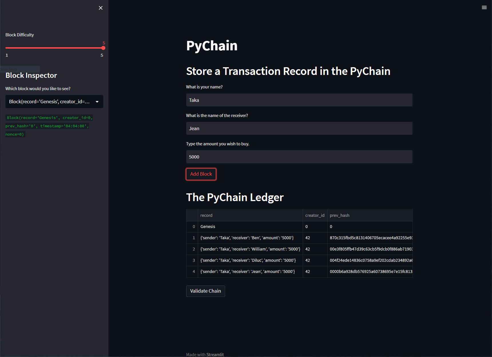

# PyChain

## Changes made
- Integrated `Record` class to store user's input
- Modified `Block` class to use data stored in `Record` class 
- Adjusted Streamlit code to take user inputs

## Example Screenshot

## Technology
`python 3.7`

`streamlit`

`dataclasses`

`typing`

`datetime`

`pandas`

`hashlib`